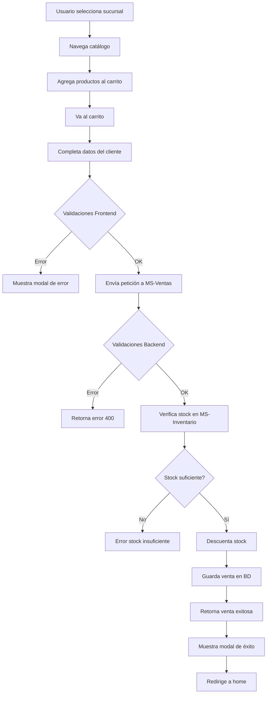

# 📋 Informe Técnico - Sistema de Farmacia Online

## 📌 Información del Proyecto

**Nombre del Proyecto:** Farmacia Online - Sistema de Gestión con Microservicios  
**Repositorio GitHub:** https://github.com/Ofchanataxi/proyecto-2P.git  
**Fecha:** Diciembre 2024  
**Tecnologías:** Spring Boot, React, MySQL, Docker

---

## 🎯 Descripción General

Sistema de farmacia online desarrollado con arquitectura de microservicios que permite la gestión de medicamentos, inventario por sucursales y procesamiento de ventas con validaciones completas de datos de clientes ecuatorianos.

---

## 🏗️ Arquitectura del Sistema

### Microservicios Implementados

#### 1. **MS-Catálogo** (Puerto 8081)
- **Responsabilidad:** Gestión del catálogo de medicamentos
- **Base de Datos:** `db_catalogo`
- **Endpoints Principales:**
  - `GET /api/medicamentos` - Listar todos los medicamentos
  - `GET /api/medicamentos/{id}` - Obtener medicamento por ID
  - `POST /api/medicamentos` - Crear nuevo medicamento
  - `PUT /api/medicamentos/{id}` - Actualizar medicamento
  - `DELETE /api/medicamentos/{id}` - Eliminar medicamento

#### 2. **MS-Inventario** (Puerto 8082)
- **Responsabilidad:** Gestión de inventario por sucursales
- **Base de Datos:** `db_inventario`
- **Endpoints Principales:**
  - `GET /api/sucursales` - Listar todas las sucursales
  - `GET /api/inventarios/sucursal/{id}` - Inventario por sucursal
  - `GET /api/inventarios/stock` - Verificar stock disponible
  - `POST /api/inventarios/descontar` - Descontar stock

#### 3. **MS-Ventas** (Puerto 8083)
- **Responsabilidad:** Procesamiento de ventas y gestión de clientes
- **Base de Datos:** `db_ventas`
- **Endpoints Principales:**
  - `POST /api/ventas` - Crear nueva venta
- **Validaciones Implementadas:**
  - Cédula ecuatoriana (algoritmo módulo 10)
  - Teléfono ecuatoriano (formato 10 dígitos)
  - Email (formato estándar)
  - Nombre (mínimo 3 caracteres)

#### 4. **MS-Frontend** (Puerto 3000)
- **Tecnología:** React + Vite
- **Características:**
  - Catálogo de productos con búsqueda
  - Carrito de compras
  - Validaciones en tiempo real
  - Modales personalizados
  - Diseño responsive

---

## 🗄️ Modelo de Datos

### Base de Datos: db_catalogo
```sql
medicamentos (
  id BIGINT PRIMARY KEY AUTO_INCREMENT,
  nombre VARCHAR(100) NOT NULL,
  codigo_barra VARCHAR(50) UNIQUE NOT NULL,
  laboratorio VARCHAR(100) NOT NULL,
  precio_unitario DECIMAL(10,2) NOT NULL,
  categoria VARCHAR(50),
  imagen_url VARCHAR(500)
)
```

### Base de Datos: db_inventario
```sql
sucursales (
  id BIGINT PRIMARY KEY AUTO_INCREMENT,
  nombre VARCHAR(100) NOT NULL,
  direccion VARCHAR(200) NOT NULL,
  telefono VARCHAR(20)
)

inventarios (
  id BIGINT PRIMARY KEY AUTO_INCREMENT,
  medicamento_id BIGINT NOT NULL,
  sucursal_id BIGINT NOT NULL,
  cantidad INT NOT NULL DEFAULT 0,
  FOREIGN KEY (sucursal_id) REFERENCES sucursales(id)
)
```

### Base de Datos: db_ventas
```sql
clientes (
  id BIGINT PRIMARY KEY AUTO_INCREMENT,
  nombre VARCHAR(100) NOT NULL,
  cedula VARCHAR(10) NOT NULL,
  direccion VARCHAR(200),
  email VARCHAR(100),
  telefono VARCHAR(10)
)

ventas (
  id BIGINT PRIMARY KEY AUTO_INCREMENT,
  cliente_id BIGINT,
  sucursal_id BIGINT NOT NULL,
  fecha TIMESTAMP DEFAULT CURRENT_TIMESTAMP,
  total DECIMAL(10,2) NOT NULL,
  FOREIGN KEY (cliente_id) REFERENCES clientes(id)
)

detalles_venta (
  id BIGINT PRIMARY KEY AUTO_INCREMENT,
  venta_id BIGINT NOT NULL,
  medicamento_id BIGINT NOT NULL,
  cantidad INT NOT NULL,
  precio_unitario DECIMAL(10,2) NOT NULL,
  subtotal DECIMAL(10,2) NOT NULL,
  FOREIGN KEY (venta_id) REFERENCES ventas(id) ON DELETE CASCADE
)
```

---

## ✅ Validaciones Implementadas

### Backend (Spring Boot)

#### 1. Validador de Cédula Ecuatoriana
**Archivo:** `CedulaEcuatorianaValidator.java`

**Algoritmo:**
- Verifica 10 dígitos numéricos
- Valida provincia (01-24)
- Aplica algoritmo módulo 10 con coeficientes [2,1,2,1,2,1,2,1,2]
- Verifica dígito verificador

**Ejemplo de uso:**
```java
@CedulaEcuatoriana
@Column(length = 10)
private String cedula;
```

#### 2. Validador de Teléfono Ecuatoriano
**Archivo:** `TelefonoEcuatorianoValidator.java`

**Reglas:**
- Exactamente 10 dígitos
- Celulares: Empiezan con 09
- Fijos: Empiezan con 02-07 (códigos de área)

**Ejemplo de uso:**
```java
@TelefonoEcuatoriano
@Column(length = 10)
private String telefono;
```

#### 3. Validación de Email
**Anotación estándar:**
```java
@Email(message = "El email debe tener un formato válido")
@Size(max = 100)
private String email;
```

### Frontend (React)

#### Validaciones en Tiempo Real
- **Cédula:** Mismo algoritmo que backend (módulo 10)
- **Teléfono:** Formato 10 dígitos ecuatoriano
- **Email:** Regex estándar
- **Nombre:** Mínimo 3 caracteres

#### Feedback Visual
- Bordes rojos para campos con error
- Bordes verdes para campos válidos
- Mensajes de error específicos debajo de cada campo
- Mensajes de éxito con checkmark

---

## 🐳 Dockerización

### Estructura de Contenedores

```yaml
services:
  mysql-db:          # Base de datos compartida
  ms-catalogo:       # Microservicio de catálogo
  ms-inventario:     # Microservicio de inventario
  ms-ventas:         # Microservicio de ventas
  ms-frontend:       # Aplicación React
```

### Dockerfiles

Cada microservicio tiene su propio `Dockerfile`:

#### Backend (Spring Boot)
```dockerfile
FROM eclipse-temurin:21-jdk-alpine AS build
WORKDIR /app
COPY . .
RUN ./mvnw clean package -DskipTests

FROM eclipse-temurin:21-jre-alpine
WORKDIR /app
COPY --from=build /app/target/*.jar app.jar
EXPOSE 808X
ENTRYPOINT ["java", "-jar", "app.jar"]
```

#### Frontend (React)
```dockerfile
FROM node:20-alpine AS build
WORKDIR /app
COPY package*.json ./
RUN npm ci
COPY . .
RUN npm run build

FROM nginx:alpine
COPY --from=build /app/dist /usr/share/nginx/html
COPY nginx.conf /etc/nginx/conf.d/default.conf
EXPOSE 3000
CMD ["nginx", "-g", "daemon off;"]
```

### Comandos Docker

```bash
# Levantar todos los servicios
docker-compose up -d

# Ver logs
docker-compose logs -f

# Detener servicios
docker-compose down

# Reconstruir servicios
docker-compose build

# Eliminar volúmenes (resetear BD)
docker-compose down -v
```

---

## 🧪 Pruebas con Postman

### Colección Incluida
**Archivo:** `Farmacia-Online.postman_collection.json`

### Endpoints Probados

#### MS-Catálogo
- ✅ GET /api/medicamentos - Listar medicamentos
- ✅ GET /api/medicamentos/{id} - Obtener por ID
- ✅ POST /api/medicamentos - Crear medicamento
- ✅ GET /api/medicamentos?categoria=X - Buscar por categoría

#### MS-Inventario
- ✅ GET /api/sucursales - Listar sucursales
- ✅ GET /api/inventarios/sucursal/{id} - Inventario por sucursal
- ✅ GET /api/inventarios/stock - Verificar stock
- ✅ POST /api/inventarios/descontar - Descontar stock

#### MS-Ventas
- ✅ POST /api/ventas - Crear venta válida
- ✅ POST /api/ventas - Error validación cédula
- ✅ POST /api/ventas - Error validación teléfono
- ✅ POST /api/ventas - Error validación email

### Importar Colección en Postman

1. Abrir Postman
2. Click en "Import"
3. Seleccionar archivo `Farmacia-Online.postman_collection.json`
4. La colección aparecerá con todos los endpoints organizados

---

## 📁 Estructura del Repositorio

```
proyecto-2P/
├── ms-catalogo/              # Microservicio de catálogo
│   ├── src/
│   │   └── main/
│   │       └── java/
│   │           └── ec/edu/espe/mscatalogo/
│   │               ├── controllers/
│   │               ├── models/
│   │               ├── repositories/
│   │               └── services/
│   ├── Dockerfile
│   └── pom.xml
│
├── ms-inventario/            # Microservicio de inventario
│   ├── src/
│   │   └── main/
│   │       └── java/
│   │           └── ec/edu/espe/msinventario/
│   │               ├── controllers/
│   │               ├── models/
│   │               ├── repositories/
│   │               ├── services/
│   │               └── clients/
│   ├── Dockerfile
│   └── pom.xml
│
├── ms-ventas/                # Microservicio de ventas
│   ├── src/
│   │   └── main/
│   │       └── java/
│   │           └── ec/edu/espe/msventas/
│   │               ├── controllers/
│   │               ├── models/
│   │               ├── repositories/
│   │               ├── services/
│   │               ├── clients/
│   │               └── validators/    # ⭐ Validadores personalizados
│   ├── Dockerfile
│   └── pom.xml
│
├── ms-frontend/              # Aplicación React
│   ├── src/
│   │   ├── components/
│   │   ├── pages/
│   │   ├── services/
│   │   └── context/
│   ├── Dockerfile
│   ├── nginx.conf
│   └── package.json
│
├── docker-compose.yml        # Orquestación de servicios
├── init.sql                  # Script de inicialización de BD
├── README.md                 # Documentación del proyecto
├── VALIDACIONES_IMPLEMENTADAS.md  # Guía de validaciones
├── Farmacia-Online.postman_collection.json  # Colección Postman
└── INFORME.md               # Este documento

```

---

## 🚀 Guía de Instalación y Ejecución

### Prerrequisitos
- Docker Desktop instalado
- Git instalado
- Navegador web moderno

### Pasos de Instalación

1. **Clonar el repositorio**
```bash
git clone https://github.com/Ofchanataxi/proyecto-2P.git
cd proyecto-2P
```

2. **Levantar los servicios con Docker**
```bash
docker-compose up -d
```

3. **Esperar a que todos los servicios inicien** (aproximadamente 30-60 segundos)

4. **Acceder a la aplicación**
- Frontend: http://localhost:3000
- API Catálogo: http://localhost:8081
- API Inventario: http://localhost:8082
- API Ventas: http://localhost:8083

### Verificación de Servicios

```bash
# Ver estado de contenedores
docker ps

# Ver logs de un servicio específico
docker logs ms-catalogo
docker logs ms-inventario
docker logs ms-ventas
docker logs ms-frontend
```

---

## 🎨 Características del Frontend

### Páginas Implementadas

1. **Home / Catálogo**
   - Listado de medicamentos
   - Búsqueda por nombre/laboratorio
   - Filtrado por categorías
   - Agregar al carrito

2. **Carrito de Compras**
   - Listado de productos seleccionados
   - Modificar cantidades
   - Eliminar productos
   - Formulario de cliente con validaciones
   - Modal de confirmación

3. **Selección de Sucursal**
   - Listado de sucursales disponibles
   - Información de ubicación

### Componentes Destacados

#### Modal Personalizado
- Reemplaza los `alert()` nativos
- Diseño profesional con animaciones
- Variantes: success (verde) y error (rojo)
- Click fuera para cerrar
- Callbacks personalizados

#### Validaciones en Tiempo Real
- Feedback inmediato al usuario
- Bordes de colores (rojo/verde)
- Mensajes específicos por campo
- Botón deshabilitado si hay errores

---

## 📊 Flujo de Negocio

### Proceso de Venta



---

## 🔒 Seguridad y Validaciones

### Validaciones de Doble Capa

#### Frontend (Primera Capa - UX)
- **Propósito:** Feedback inmediato al usuario
- **Tecnología:** JavaScript/React
- **Ventaja:** Experiencia de usuario fluida

#### Backend (Segunda Capa - Seguridad)
- **Propósito:** Garantizar integridad de datos
- **Tecnología:** Spring Boot Validation
- **Ventaja:** Seguridad robusta

### Ejemplos de Validación

#### Cédula Válida
```
Entrada: 1714567890
✅ Provincia válida: 17 (Pichincha)
✅ Dígito verificador correcto
✅ Resultado: VÁLIDA
```

#### Cédula Inválida
```
Entrada: 1234567891
❌ Dígito verificador incorrecto
❌ Resultado: INVÁLIDA
Mensaje: "Cédula ecuatoriana inválida (dígito verificador incorrecto)"
```

#### Teléfono Válido
```
Entrada: 0987654321
✅ 10 dígitos
✅ Empieza con 09 (celular)
✅ Resultado: VÁLIDO
```

#### Teléfono Inválido
```
Entrada: 1234567890
❌ No empieza con código válido
❌ Resultado: INVÁLIDO
Mensaje: "El teléfono debe comenzar con 09 (celular) o 02-07 (fijo)"
```

---

## 📈 Métricas del Proyecto

### Líneas de Código (Aproximado)
- **Backend (Java):** ~2,500 líneas
- **Frontend (React):** ~1,800 líneas
- **SQL:** ~150 líneas
- **Configuración:** ~200 líneas

### Archivos Creados
- **Clases Java:** 38 archivos
- **Componentes React:** 8 archivos
- **Servicios:** 6 archivos
- **Dockerfiles:** 4 archivos

### Endpoints API
- **Total:** 12 endpoints
- **GET:** 7 endpoints
- **POST:** 5 endpoints

---

## 🐛 Problemas Conocidos y Soluciones

### Problema 1: Servicios no inician
**Solución:**
```bash
docker-compose down -v
docker-compose up -d
```

### Problema 2: Puerto ocupado
**Solución:**
```bash
# Cambiar puertos en docker-compose.yml
ports:
  - "3001:3000"  # En lugar de 3000:3000
```

### Problema 3: Caché del navegador
**Solución:**
- Presionar Ctrl + Shift + R (hard refresh)
- O abrir ventana de incógnito

---

## 🔄 Mejoras Futuras Sugeridas

### Funcionalidades
- [ ] Autenticación y autorización (JWT)
- [ ] Historial de compras por cliente
- [ ] Sistema de descuentos y promociones
- [ ] Reportes de ventas
- [ ] Notificaciones por email
- [ ] Pasarela de pagos

### Técnicas
- [ ] Tests unitarios (JUnit, Jest)
- [ ] Tests de integración
- [ ] CI/CD con GitHub Actions
- [ ] Monitoreo con Prometheus/Grafana
- [ ] Logs centralizados (ELK Stack)
- [ ] API Gateway

---

## 👥 Equipo de Desarrollo

**Desarrolladores:**
- Camila (Validaciones y Frontend)
- [Otros miembros del equipo]

**Tecnologías Utilizadas:**
- Spring Boot 4.0.0
- React 18
- MySQL 8.0
- Docker & Docker Compose
- Nginx
- Maven

---

## 📚 Referencias

### Documentación
- [Spring Boot Documentation](https://spring.io/projects/spring-boot)
- [React Documentation](https://react.dev/)
- [Docker Documentation](https://docs.docker.com/)
- [MySQL Documentation](https://dev.mysql.com/doc/)

### Algoritmos
- Validación de Cédula Ecuatoriana: Algoritmo Módulo 10
- Formato de Teléfono: Estándar ecuatoriano

---

## 📄 Licencia

Este proyecto es de uso académico para la Universidad ESPE.

---

## 📞 Contacto y Soporte

Para consultas o problemas:
- **Repositorio:** https://github.com/Ofchanataxi/proyecto-2P
- **Issues:** https://github.com/Ofchanataxi/proyecto-2P/issues

---

**Fecha de Última Actualización:** Diciembre 2024  
**Versión del Informe:** 1.0
